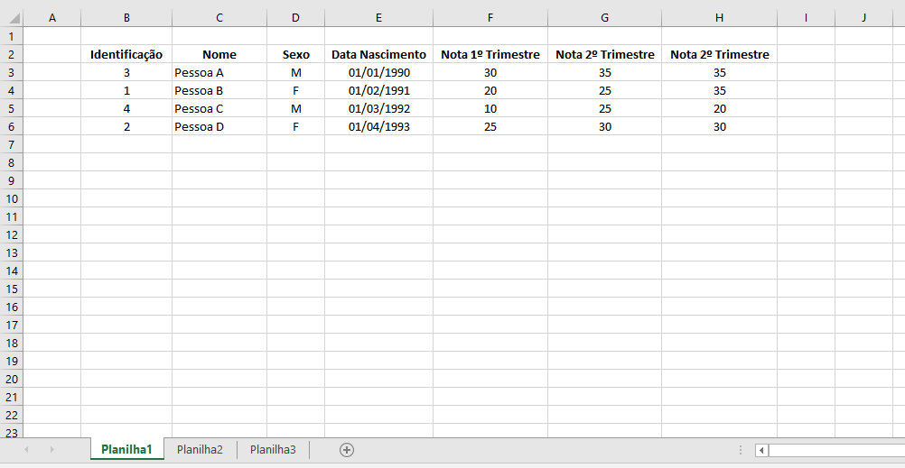
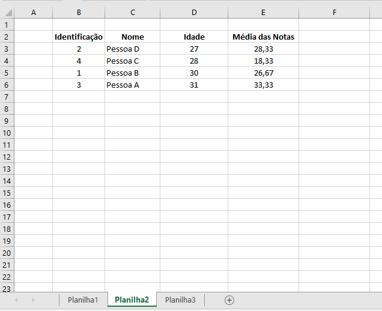
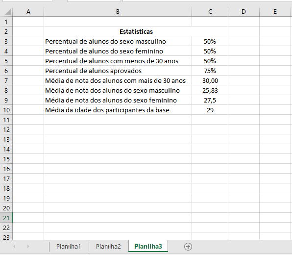

# Teste Rodarte Nogueira

🚀 Sistema de manipulação de Excel e cálculo estatísticas básicas

## 💻 Requisitos mínimos para execução do projeto:
- [x] Java
- [x] Git
- [x] MySql

---
## 💻 Qual o objetivo?
Todo o desenvolvimento do projeto deverá ser feito em uma bifurcação do projeto no seu repositório (GitHub/Gitlab/Bitbucket), utilizando as blibliotecas já inclusas no pom.xml.

A solução deste teste deverá ser compartilhada pelo seu fork do repositório, não se esqueça de commitar suas alterações.

Ao concluir o projeto ele deverá:

- [x] Realizar a leitura e extração dos dados do arquivo Excel que pode ser encontrado no menu ‘Arquivos’;
- [x] Armazenamento dos dados extraídos em base de dados;
	- [x] Exportação de relatório Excel contendo 3 abas, conforme descrito abaixo:
	- [x]  1ª aba: relação de todos os participantes e as informações inseridas, ordenadas pelo nome em ordem alfabética.
	- [x] 2ª aba: relação dos participantes, contendo o nome, a idade de cada um e a média das notas. Os participantes deverão ser ordenados pela idade crescente.
	- [x] 3ª aba: uma tabela estatística contendo informações como: percentual geral de aprovados (considerando mínimo 70% para aprovação, e total de 100 pontos) e também segregado por sexo.

## ⚙️ Entrega de resultados

- [x] **Data de entrega:**26/02/2021
- [x] **Forma de entrega:** Envie um email com a url do **seu repositório git público**, e o arquivo de resultado, obtido a partir da execução do sistema.

## 🖼️ Exemplos de resultados

---

## 🛠 Tecnologias

As seguintes ferramentas foram usadas na construção do projeto:
- **[Java](https://www.java.com/pt-BR/)**
- **[Mysql](https://www.mysql.com/)**
- **[Git](https://git-scm.com/)**

#### **Utilitários**

- Markdown:  **[Pandao](pandao.github.io/)**

---

## 🦸 Autor

 
  
 <b>Leandro Aquino </b></a> 
  

---

## 📝 Licença

Este projeto esta sobe a licença [MIT](./LICENSE).

Feito com ❤️ por Jefferson Silva 👋🏽 [Entre em contato!](https://rodartenogueira.com.br/)

---
